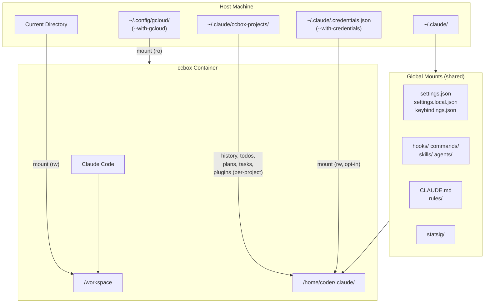

# Architecture

One repository produces three container images and three launchers from a shared Dockerfile and launcher engine:

| Launcher | Harness | Image | Version pin file | Firewall overlay |
|----------|---------|-------|------------------|------------------|
| `ccbox` | [Claude Code](https://claude.com/product/claude-code) | `quay.io/guimou/ccbox` | `CLAUDE_VERSION` | `firewall-domains-claude.txt` |
| `ocbox` | [OpenCode](https://opencode.ai) | `quay.io/guimou/ocbox` | `OPENCODE_VERSION` | `firewall-domains-opencode.txt` |
| `qcbox` | [Qwen Code](https://github.com/QwenLM/qwen-code) | `quay.io/guimou/qcbox` | `QWENCODE_VERSION` | `firewall-domains-qwencode.txt` |

## Design Principles

- **Mount only the current folder** — the project directory is the only host code visible inside the container, at `/workspace`.
- **Per-project isolation** — each project gets its own history and session data; sessions of different projects never mix.
- **Share only what is truly shareable** — credentials, global settings, and caches are shared across projects; everything stateful is per-project.
- **Host integration where it helps** — clipboard/display, audio, timezone, gcloud credentials (read-only, opt-in via `--with-gcloud`), host gitconfig (read-only, opt-in via `--with-gitconfig`), Claude credentials (read-write, opt-in via `ccbox --with-credentials`), GitHub token, and host-installed global npm packages (read-only) are connected from the host.
- **Rootless and SELinux-friendly** — Podman rootless with `--userns=keep-id`, `:z` volume labels on Linux.

## One Dockerfile, Three Images

The Dockerfile is parameterized by two build args:

- `HARNESS` — `claude`, `opencode`, or `qwencode`; selects which single CLI is installed and which firewall overlay is baked in.
- `HARNESS_VERSION` — the harness version to install (empty means latest).

All common layers (Fedora 44 base, OS packages, language runtimes, dev tools, Rust toolchain, firewall script, environment setup) come **first** and never reference `HARNESS`, so the Docker build cache is fully shared across the three images. A single harness-specific block at the end:

1. Concatenates `firewall-domains.txt` with `firewall-domains-${HARNESS}.txt` into `/etc/codebox/firewall-domains.txt`.
2. Installs exactly one harness CLI:
   - `claude` → native installer from claude.ai
   - `opencode` → `npm install -g opencode-ai@<version>`
   - `qwencode` → `npm install -g @qwen-code/qwen-code@<version>`, plus a baked `/etc/qwen-code/settings.json` that disables auto-update and Qwen's own sandbox (to avoid sandbox-in-container nesting)

Auto-updaters are disabled for all harnesses — versions are controlled by the pin files and image builds.

## One Engine, Three Launchers

The launchers are thin wrappers around a shared engine, `lib/box-common.sh`:

- Each wrapper defines **identity variables** (box name, harness, CLI binary, registry image, version flag/file, environment passthrough patterns).
- The engine provides everything common: argument parsing, image pull/build/tag resolution, project keying, container naming, base mounts (workspace, timezone, audio), opt-in host mounts (`--with-gcloud`, `--with-gitconfig`), clipboard wiring, npm-global mount, GitHub token injection, firewall capabilities, and the final `podman run`.
- Wrappers customize behavior through **hook functions** the engine calls at defined points: `harness_parse_arg` (harness-specific flags), `harness_ensure_config` (create global config on first run), `harness_setup_project` (create per-project host directories), `harness_mounts` (harness-specific volume mounts), `harness_pre_run` (wrap the launch command, e.g. tmux), and `harness_log_status`.

The wrappers locate the engine relative to their (symlink-resolved) location, supporting two layouts: a repo clone (`lib/box-common.sh` next to the launchers, used via symlinks) or a flat install (`box-common.sh` copied next to the launchers, e.g. in `~/.local/bin`). In a flat install there are no version pin files or Dockerfile, so the image tag defaults to `latest` (overridable with the version flag) and `--build` is unavailable.

## Container Runtime

- **Base**: `quay.io/fedora/fedora:44`
- **User**: `coder` (UID 1000) for `--userns=keep-id` compatibility
- **SELinux**: `:z` volume labels for shared relabeling (multi-session safe); omitted on macOS (virtiofs)
- **Container name**: `{box}-{project}-{hash}-{session-id}` — multiple sessions can run simultaneously in the same project, sharing project data
- **Firewall**: optional (`--with-firewall`), iptables/ipset allowlist, requires `NET_ADMIN`/`NET_RAW` (added automatically), Linux only

> **Breaking change:** the container user and home folder were renamed from `claude` to `coder`. Images built before this change use `/home/claude`; rebuild or re-pull (`ccbox --build` / re-pull from the registry) so mounts line up with `/home/coder`. Host-side data is unaffected — `~/.claude/`, `~/.local/share/ocbox-projects/`, and `~/.qwen/qcbox-projects/` are unchanged; only the in-container home path moved.

## The Project Isolation Problem

Every project mounts at `/workspace` inside its container. Harnesses that key their internal state by project *path* (OpenCode, Qwen Code) would therefore collide: every project would look like the same project.

The launchers solve this **host-side**: each project gets its own host directory (keyed by `{sanitized-name}_{md5-hash-of-path}`) which is mounted *as* the harness's data/state directory inside the container. Shared items (credentials) are file-mounted on top.

## Per-Harness Mounts

Common to all launchers (handled by the engine): workspace, clipboard/display, PulseAudio, timezone, npm-global (ro), GitHub token env. Opt-in host mounts: `--with-gcloud` (gcloud, ro), `--with-gitconfig` (gitconfig, ro), `ccbox --with-credentials` (`.credentials.json`, rw).

### ccbox (Claude Code)

| Location | Purpose | Scope |
|----------|---------|-------|
| **Settings** | | |
| `~/.claude/settings.json` | Global settings | Shared |
| `~/.claude/settings.local.json` | Local settings (not synced) | Shared |
| `~/.claude/keybindings.json` | Keyboard shortcuts | Shared |
| **Authentication** | | |
| `~/.claude/.credentials.json` | API credentials (opt-in, `--with-credentials`) | Shared (rw, not mounted by default) |
| `~/.claude.json` | Claude config | Shared |
| **Extensions** | | |
| `~/.claude/hooks/` | Custom hooks | Shared |
| `~/.claude/commands/` | Global slash commands | Shared |
| `~/.claude/skills/` | Global skills | Shared |
| `~/.claude/agents/` | Global subagents | Shared |
| `~/.claude/workflows/` | Saved workflow scripts | Shared |
| `~/.claude/daemon/` | Background agent daemon state | Per-container (not mounted) |
| **Memory & Rules** | | |
| `~/.claude/CLAUDE.md` | Global memory/instructions | Shared |
| `~/.claude/rules/` | Global rules | Shared |
| **Project Data** | | |
| `~/.claude/ccbox-projects/{name}_{hash}/` | History, todos, plans, tasks, plugins | Per-project |

The background agent daemon (`~/.claude/daemon/`) is deliberately **not** shared with the host: its lock file stores a PID, which is not valid across PID namespaces, so sharing it would let host and container daemons take over and kill each other. Each container runs its own isolated daemon instead. Consequence: background agents and sessions started inside ccbox die with the container and are not visible from the host (and vice versa).

### ocbox (OpenCode)

| Location | Purpose | Scope |
|----------|---------|-------|
| `~/.config/opencode/` | Global config, agents, commands, themes | Shared |
| `~/.local/share/opencode/auth.json` | Provider credentials | Shared |
| `~/.cache/opencode/` | Provider packages, LSP binaries | Shared |
| `~/.local/share/ocbox-projects/{name}_{hash}/data/` | Sessions, storage, logs (mounted as the container data dir) | Per-project |

The per-project host directory is mounted as the container's entire OpenCode data directory (`~/.local/share/opencode`), with the shared `auth.json` file-mounted on top so credentials stay global.

### qcbox (Qwen Code)

| Location | Purpose | Scope |
|----------|---------|-------|
| `~/.qwen/settings.json` | User settings | Shared |
| `~/.qwen/oauth_creds.json` | Qwen OAuth credentials | Shared |
| `~/.qwen/QWEN.md` | Global memory file | Shared |
| `~/.qwen/qcbox-projects/{name}_{hash}/tmp/` | Shell history, checkpoints | Per-project |
| `~/.qwen/qcbox-projects/{name}_{hash}/file-history/` | File backups | Per-project |

An optional `~/.qwen/.env` is mounted read-only if present.

## Firewall

When launched with `--with-firewall` (Linux only), outbound connections are restricted to an allowlist baked into each image at build time from two files:

- `firewall-domains.txt` — common to all harnesses: GitHub (`github.com`, `api.github.com`, `objects.githubusercontent.com`, plus their IP ranges), npm registry, Python packages (`pypi.org`, `files.pythonhosted.org`), Rust packages (`crates.io`, `static.crates.io`)
- `firewall-domains-{claude,opencode,qwencode}.txt` — harness-specific:
  - **claude**: `api.anthropic.com`, `statsig.anthropic.com`, `claude.ai`, `code.claude.com`, `sentry.io`
  - **opencode**: `opencode.ai`, `api.opencode.ai`, `models.dev`, plus common provider endpoints
  - **qwencode**: `chat.qwen.ai`, `portal.qwen.ai`, DashScope endpoints, plus common provider endpoints

`init-firewall.sh` resolves the allowlist into an ipset at container start and installs default-deny iptables rules.

**Limitations:** Web search, web fetch, and HTTP-based MCP servers will **not** work with the firewall enabled, as they require access to arbitrary domains. Only stdio MCP servers (local processes) function behind the firewall.
